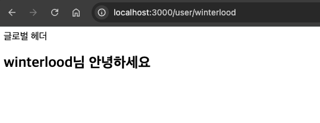
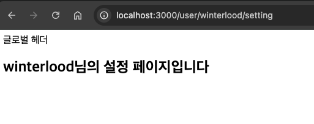

## 미션) 사용자 프로필, 설정 페이지 추가하기

이번 과제는 **사용자 프로필 및 설정 페이지 추가하기** 입니다.

## 미션 제출 방법

미션 제출은 다음 방법중 하나를 선택하시면 됩니다.

1. 결과 화면 캡쳐
   - 페이지 결과물만 주소와 함께 캡쳐하시거나 프로젝트 파일 구조를 함께 캡쳐해주세요
2. GitHub에 프로젝트 업로드 후 링크로 공유

> [정답 보기](https://github.com/winterlood/onebite-next-challenge/blob/main/missions/day02/mission/answer)

## 미션 소개

오늘의 미션은 **사용자 프로필 및 설정 페이지 추가하기** 입니다.  
**2.2) 페이지 라우팅 설정하기** 실습까지 완료된 Next.js 앱에 다음 2개의 페이지를 새롭게 추가해주세요  
(만약 실습 환경을 수정하고 싶지 않으시다면 별도의 프로젝트를 생성해 진행하셔도 무방합니다!)

1. user/[username] 페이지
2. user/[username]/setting 페이지

페이지별 요구사항은 다음과 같습니다.

### 1. user/[username] 페이지

아래 그림처럼 \<h1> 태그로 현재 접속한 유저의 이름을 출력합니다.

> ex) ~/user/hbin12212 -> "hbin12212님 안녕하세요" 출력

### 2. user/[username]/setting 페이지

아래 그림처럼 \<h1> 태그로 "[username]님의 설정 페이지입니다"라는 텍스트를 출력합니다.

> ex) ~/user/hbin12212 -> "hbin12212님의 설정 페이지입니다" 출력
