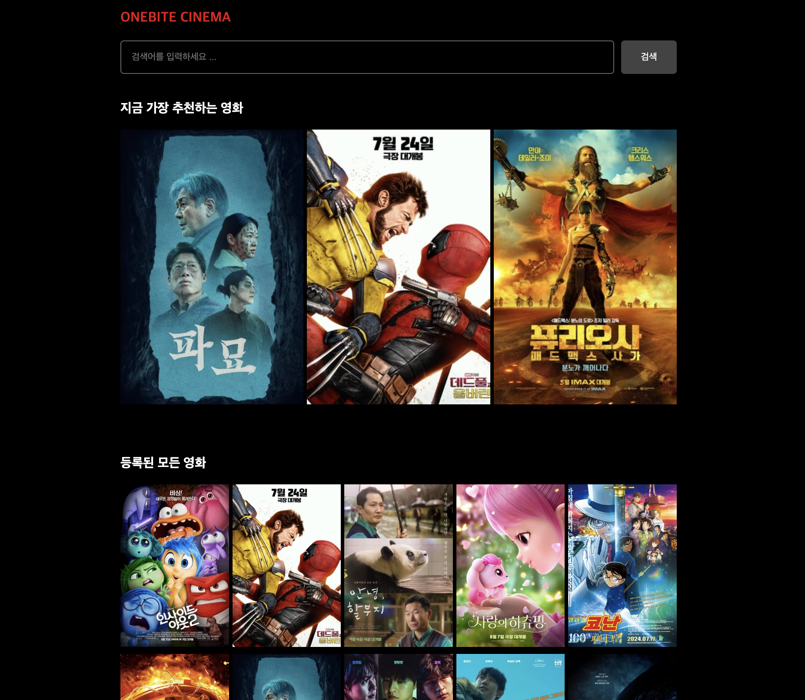
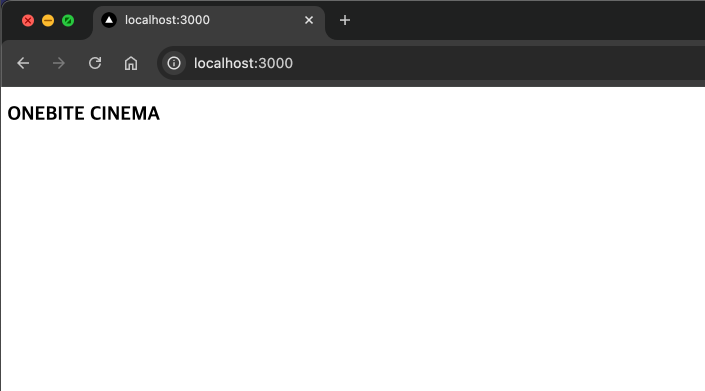
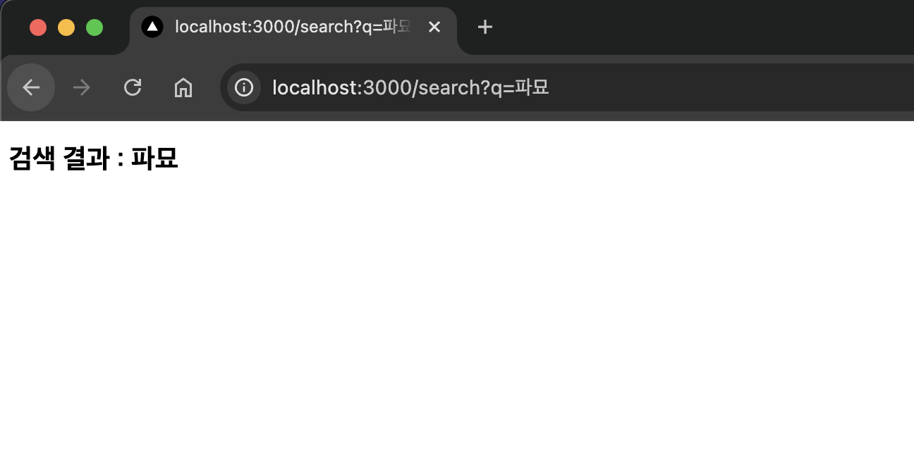
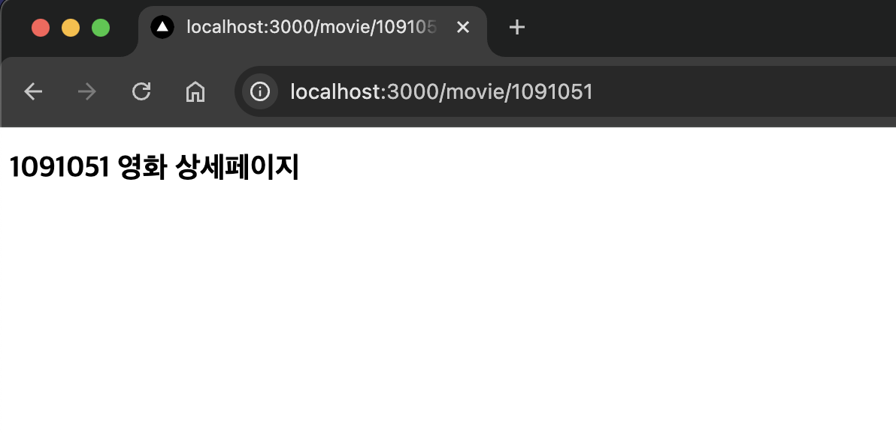

## 미션) 한입-씨네마 프로젝트 생성 & 라우팅 설정하기

우리 챌린지에서 앞으로 쭉 활용될 **한입-씨네마** 프로젝트를 새롭게 생성하고 라우팅을 설정합니다.

## 미션 제출 방법

미션 제출은 다음 방법중 하나를 선택하시면 됩니다.

1. 결과 화면 캡쳐
   - 페이지 결과물만 주소와 함께 캡쳐하시거나 프로젝트 파일 구조를 함께 캡쳐해주세요
   - 여러장 올리셔도 됩니다!
2. GitHub에 프로젝트 업로드 후 링크로 공유

> [정답 보기](https://github.com/winterlood/onebite-next-challenge/blob/main/missions/day02/mission/answer)

## 미션 소개) 한입 씨네마 프로젝트 생성 및 라우팅 설정하기

**한입 씨네마**는 위 그림에 보이시는 것 처럼 영화 리뷰를 제공하는 간단한 사이트로  
앞으로 여러분께서 미션을 통해 천천히 만들어나가게 될 프로젝트입니다.

오늘의 미션은 **한입-씨네마** 프로젝트 생성 및 라우팅 설정 입니다.  
아래 안내드리는 순서에 따라 미션을 수행해주세요

### 1. 새로운 Next App 생성하기 (Page Router 버전)

강의에서 소개해드린 방법대로 새로운 Next App을 생성하세요

- Page Router를 사용하는 버전으로 생성합니다.
- 프로젝트 이름은 onebite-cinema 혹은 자유롭게 설정하시면 됩니다.

### 2. 라우팅 설정하기

다음과 같이 라우팅을 설정해주세요

- <code>/</code> : 인덱스 페이지
- <code>/search</code> : 검색 페이지
- <code>/movie/[id]</code> : 영화 상세 페이지

페이지 별 요구사항은 다음과 같습니다.

#### 1. "/" 인덱스 페이지

아래 그림처럼 "ONEBITE CINEMA" 라는 텍스트를 렌더링합니다.

#### 2. "/search" 검색 페이지

아래 그림처럼 "검색 결과 : {q}"를 렌더링합니다.

#### 3. "movie/[id]" 영화 상세 페이지

아래 그림처럼 "{id} 영화 상세페이지"를 렌더링합니다.

