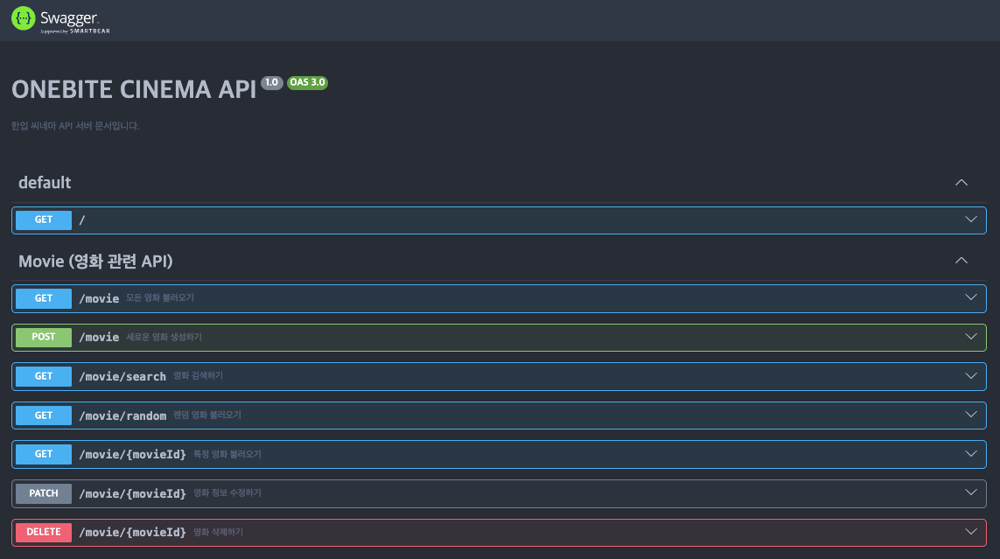

## 미션) 한입-씨네마 백엔드 서버 세팅하기

앞으로의 프로젝트 진행을 위해 **한입 씨네마 백엔드 서버**를 각자의 PC에 세팅합니다.

## 미션 제출 방법

미션 제출은 다음 방법중 하나를 선택하시면 됩니다.

1. API 문서 화면 캡쳐
   - 세팅이 완료된 백엔드 서버의 API 문서(~/api)로 접속하신 다음 스크린샷을 찍어 올려주세요
   - 또는 백엔드 서버가 가동중인 터미널의 사진을 찍어서 올려주셔도 괜찮습니다.

## 미션 소개) 한입 씨네마 백엔드 서버 세팅하기

다음은 **한입 씨네마 백엔드 서버**의 코드가 저장되어 있는 GitHub 저장소입니다.  
아래 링크에 접속하셔서 강의에서 배운대로 백엔드 서버를 직접 설정해주세요!

[https://github.com/winterlood/onebite-cinema-api](https://github.com/winterlood/onebite-cinema-api)

서버 세팅방법은 우리 강의의 "1.3 실습용 백엔드 서버 세팅하기"에 소개해드린 방식과 완전히 동일합니다.  
새로운 Supabase 프로젝트를 생성하고 Connection String을 설정하신 다음 백엔드 서버를 가동해보세요!

백엔드 서버의 설정이 완료되었다면 npm run build로 빌드한 다음 npm run start로 가동하고  
http://localhost:12345/api 주소로 접속하면 나타나는 API 문서를 캡쳐해 미션 인증으로 올려주세요

