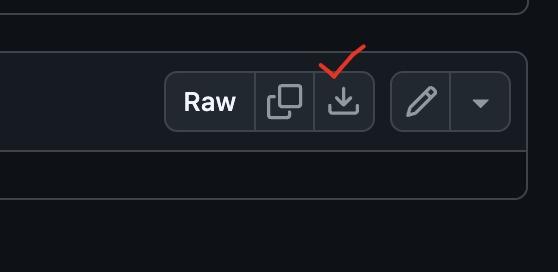

## 미션) 한입-씨네마 Page Router 버전 완성하기

페이지 라우터를 사용하는 버전의 "한입 씨네마" 프로젝트를 완성해 배포합니다.

## 미션 제출 방법

미션 제출은 다음 방법중 하나를 선택하시면 됩니다.

1. 소스코드와 배포된 링크 공유

> [정답 보기](https://github.com/winterlood/onebite-next-challenge/blob/main/missions/day08/mission/answer)

## 미션 소개) 한입-씨네마 Page Router 버전 완성하기

오늘의 미션은 **한입 씨네마 완성하기**입니다.  
아래의 조건들을 만족한 상태로 프로젝트를 배포하고 링크를 포스트로 남겨주세요

데모 : https://onebite-cinema-page-pi.vercel.app/

- **인덱스 페이지 ISR 적용하기 (시간 기반 ISR)**
  - 특정 시간을 주기로 추천 도서를 갱신할 수 있도록 인덱스 페이지에 ISR을 적용해주세요
  - On Demand 방식을 사용하실 필요는 없습니다.
- **배포 준비 및 SEO 설정하기**

  - 파비콘을 적용해주세요
  - 페이지별 메타태그 설정을 완료해주세요

- **백엔드 서버 배포하기 및 API 요청경로 수정하기**
  - 백엔드 서버를 배포한 다음, 배포된 주소를 API 요청경로로 수정해주세요

파비콘 및 썸네일 파일은 아래의 링크에서 다운로드 하실 수 있습니다.  
만약 원하시는 디자인이 있다면 자유롭게! 원하시는 파일 이용하셔도 됩니다.

[파비콘 및 썸네일 압축 파일 다운로드 링크](https://github.com/winterlood/onebite-next-challenge/blob/main/assets/onebite-cinema.zip)

> 우측 상단의 다운로드 아이콘을 누르시면 압축 파일을 다운받으실 수 있어요!

