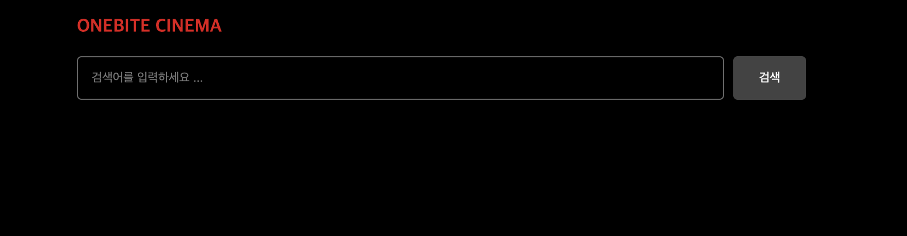

## 미션) App Router 버전 "한입-씨네마" 라우팅 & 레이아웃 설정하기

App Router 버전의 "한입 씨네마" 프로젝트를 새롭게 생성하고  
프로젝트의 라우팅과 글로벌 및 페이지별 레이아웃을 설정해 봅니다.

## 미션 제출 방법

미션 제출은 다음 방법중 하나를 선택하시면 됩니다.

1. 결과 화면 캡쳐
   - 페이지 결과물만 주소와 함께 캡쳐하시거나 프로젝트 파일 구조를 함께 캡쳐해주세요
   - 여러장 올리셔도 됩니다!
2. GitHub에 프로젝트 업로드 후 링크로 공유

> [정답 보기](https://github.com/winterlood/onebite-next-challenge/blob/main/missions/day09/mission/answer)

## 미션 소개) App Router 버전 "한입-씨네마" 라우팅 & 레이아웃 설정하기

아래 안내드리는 순서에 따라 미션을 수행해주세요

### 1. 프로젝트 생성하기

App Router를 사용하는 새로운 Next.js 프로젝트를 생성해주세요  
이름은 onebite-cinema-app 또는 자유롭게 설정하시면 됩니다.  
버전은 반드시 RC 버전으로 진행해주세요!!

### 2. 라우팅 설정하기

한입 씨네마 프로젝트를 위한 라우팅을 설정해주세요 각각 다음과 같습니다.

- <code>/</code> : 인덱스 페이지
- <code>/search</code> : 검색 페이지
- <code>/movie/[id]</code> : 영화 상세 페이지

### 3. 글로벌 레이아웃 설정하기

> 페이지 라우터 버전의 코드를 동일하게 복사-붙여넣기 하셔도 됩니다!

다음 조건을 만족하도록 글로벌 레이아웃을 설정하세요  
참고로 글로벌 레이아웃이란 모든 페이지에 동일하게 적용되는 레이아웃을 말합니다.

**글로벌 레이아웃에는 다음 요소가 있어야합니다.**

- **header**
  - "ONEBITE CINEMA" 라는 텍스트가 렌더링 되는 헤더가 존재해야 합니다.
  - 클릭시 "/" 페이지로 이동합니다.
  - 컬러는 붉은색, rgb(229,9,20)로 설정합니다
  - 폰트 사이즈는 20px로 설정합니다.
- **children**
  - header 요소 아래에 페이지 컴포넌트를 렌더링 합니다.

**스타일은 다음과 같이 설정합니다.**

- background는 검은색, rgb(0,0,0)으로 설정합니다.
- 기본 폰트 컬러는 흰색, rgb(255,255,255)로 설정합니다.
- 컨테이너 최대 너비(max-width)를 800px로 설정해 화면 가운데에 배치되도록 설정합니다.
- 컨테이너 좌우 여백을 20px 만큼 적용합니다.

### 4. 검색바 레이아웃 설정하기

> 페이지 라우터 버전의 코드를 동일하게 복사-붙여넣기 하셔도 됩니다!

다음 조건을 만족하도록 검색바 레이아웃을 설정하세요

- 검색바 레이아웃은 "/", "/search" 페이지에만 적용됩니다.
- 위 그림과 같은 검색바가 존재하며 검색 버튼 클릭시 "/search" 페이지로 이동합니다.
  - 이때의 검색어는 쿼리스트링 q로 전달됩니다.
