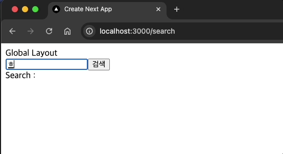

## 미션) "한입-씨네마" 서치바 컴포넌트 만들기

한입 씨네마 프로젝트의 검색을 담당하는 "서치바" 컴포넌트를 만들어봅시다

## 미션 제출 방법

미션 제출은 다음 방법중 하나를 선택하시면 됩니다.

1. 결과 화면 캡쳐
   - 페이지 결과물만 주소와 함께 캡쳐하시거나 프로젝트 파일 구조를 함께 캡쳐해주세요
   - 여러장 올리셔도 됩니다!
2. GitHub에 프로젝트 업로드 후 링크로 공유

> [정답 보기](https://github.com/winterlood/onebite-next-challenge/blob/main/missions/day10/mission/answer)

## 미션 소개) "한입-씨네마" 서치바 컴포넌트 만들기

이번 미션의 주제는 한입 씨네마 프로젝트의 "서치바 컴포넌트 구현하기" 입니다.  
아래의 요구사항에 맞도록 서치바 컴포넌트를 구현해 주세요!

- **서치바 컴포넌트**는 **서치바 레이아웃 컴포넌트**의 자식 컴포넌트입니다.

  - 위 조건으로 인해 **서치바 레이아웃**이 적용된 모든 페이지에는 **서치바 컴포넌트**가 렌더링 됩니다.

- 검색어를 입력한 다음 **검색** 버튼을 클릭하면 `~/search?q={검색어}` 페이지로 이동합니다.

  - Enter 키 입력이 발생해도 동일하게 동작합니다.

- 서치바 컴포넌트의 input 태그는 현재의 쿼리 스트링 q의 값을 초기값으로 갖습니다.
  - ex) `~/search?q={123}` 주소로 접속하면 검색바의 초기값이 123으로 자동 설정됩니다.
