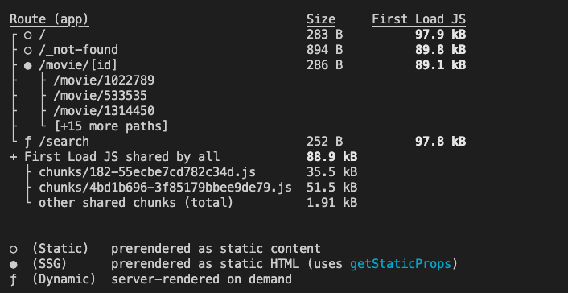

## 미션) 한입-씨네마 풀라우트 캐시 적용하기

"한입 씨네마" 프로젝트의 각 페이지에 **풀 라우트 캐시**를 적용해 봅시다!

## 미션 제출 방법

미션 제출은 다음 방법중 하나를 선택하시면 됩니다.

1. **빌드 결과 화면 캡쳐**

   - 풀 라우트 캐시가 잘 적용되었는지 확인하기 위해 빌드 결과를 꼭 찍어서 올려주세요!
   - 예시는 다음과 같습니다. 

2. GitHub에 프로젝트 업로드 후 링크로 공유

> [정답 보기](https://github.com/winterlood/onebite-next-challenge/blob/main/missions/day13/mission/answer)

## 미션 소개) 한입-씨네마 풀라우트 캐시 적용하기

> 주의. 빌드 중 useSearchParams를 사용하는 서치바 컴포넌트로 인해 오류가 발생할 수 있습니다. 이 경우 강의에서 안내드린대로 \<Suspense> 컴포넌트를 사용해 해결해주세요

다음 요구사항을 참고해 "한입 씨네마" 프로젝트의 각 페이지에 **풀 라우트 캐시**를 적용해 주세요

- 서치 페이지를 제외한 모든 페이지를 **Static 페이지**로 설정해주세요
- 동적 경로를 갖는 무비 페이지는 아래의 조건도 함께 만족하도록 설정해주세요
  - 빌드 타임에 존재하는 모든 영화의 상세 페이지를 생성해야 합니다.
  - 빌드 타임에 생성하지 못한 페이지에 대해서는 404를 return 하도록 설정합니다.
