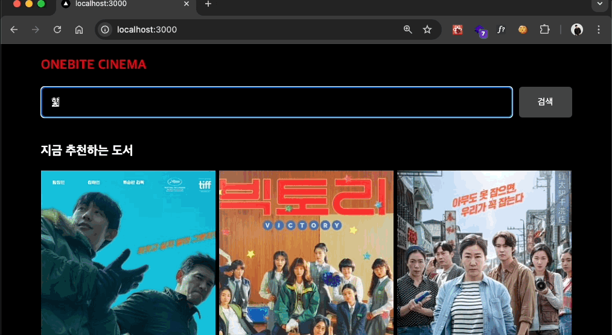

## 미션) 한입-씨네마 스트리밍 적용하기

"한입 씨네마" 프로젝트에 **스트리밍**을 적용해주세요!

## 미션 제출 방법

미션 제출은 다음 방법중 하나를 선택하시면 됩니다.

1. 캡쳐를 통해 소스코드 or 실행 화면 공유
2. GitHub에 프로젝트 업로드 후 링크로 공유
3. 배포 후 결과물 공유

> [정답 보기](https://github.com/winterlood/onebite-next-challenge/blob/main/missions/day14/mission/answer)

## 미션 소개) 한입-씨네마 스트리밍 적용하기

스트리밍은 Static이 아닌 Dynamic 페이지에 필요한 기능입니다. 여러분의 프로젝트의 Dynamic 페이지에 스트리밍을 적용해보세요

추가로 스트리밍이 잘 작동하는걸 확인하기 위해 delay 함수를 만들어 활용 해 보시면 더 좋을 것 같아요!

