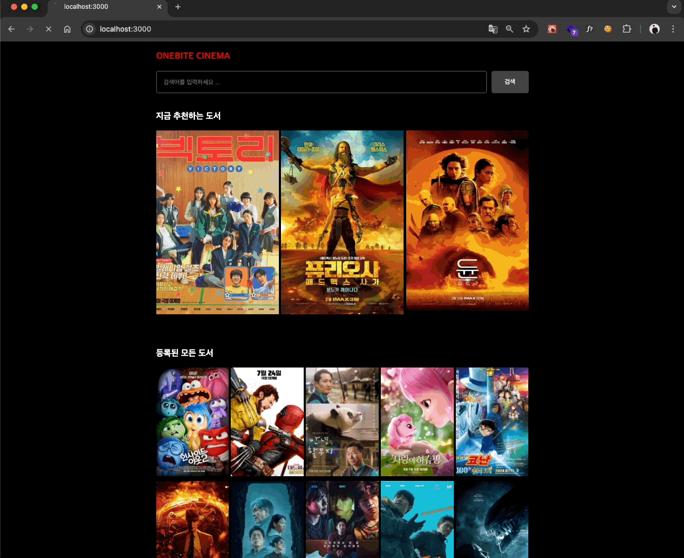

## 미션) 한입-씨네마 컴포넌트별 스트리밍 적용하기 (with Suspense)

"한입 씨네마" 프로젝트에 **컴포넌트별로 스트리밍**을 적용해주세요!

## 미션 제출 방법

미션 제출은 다음 방법중 하나를 선택하시면 됩니다.

1. 캡쳐를 통해 소스코드 or 실행 화면 공유
2. GitHub에 프로젝트 업로드 후 링크로 공유
3. 배포 후 결과물 공유

> [정답 보기](https://github.com/winterlood/onebite-next-challenge/blob/main/missions/day15/mission/answer)

## 미션 소개) 한입-씨네마 컴포넌트별 스트리밍 적용하기 (with Suspense)

다음 조건을 만족하도록 각 페이지에 스트리밍을 적용해주세요

- 인덱스 페이지와 서치 페이지에 각각 Suspense를 활용한 스트리밍을 적용합니다.
- 인덱스 페이지
  - 추천 영화, 모든 영화 섹션에 각각 따로 스트리밍을 적용합니다.
  - 각 섹션의 스트리밍 동작을 확인하기 위해 서로 다른 delay를 적용합니다. (선택)
- 서치 페이지
  - 브라우저에서 새롭게 검색하면 스트리밍을 다시 트리거해야 합니다.

