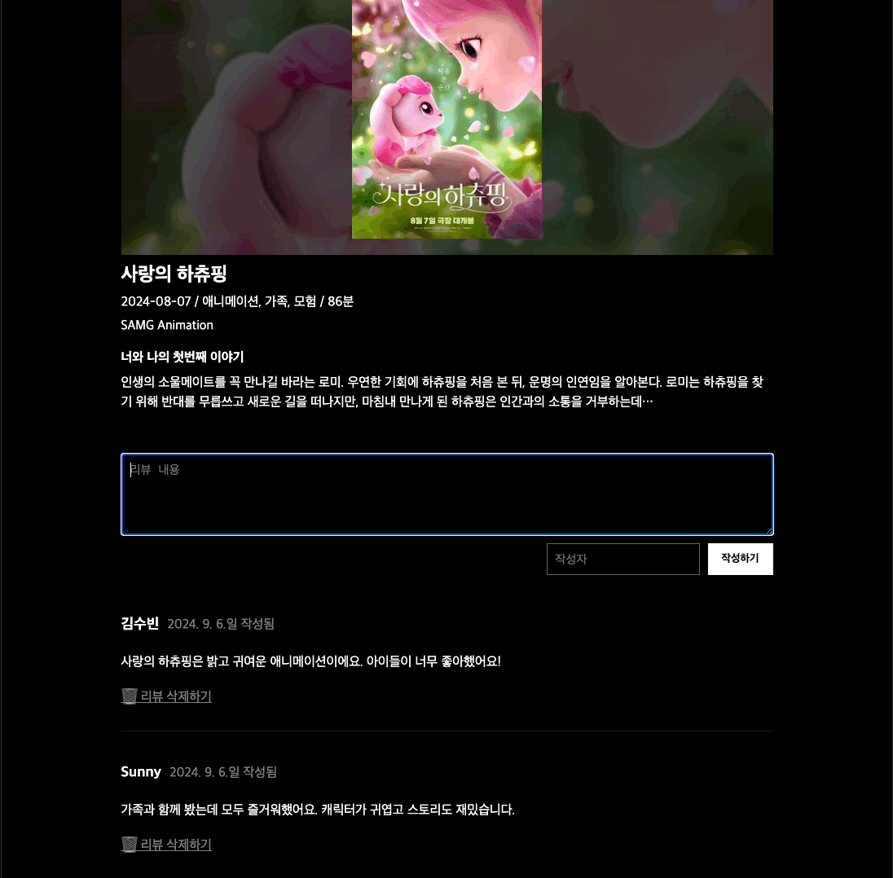
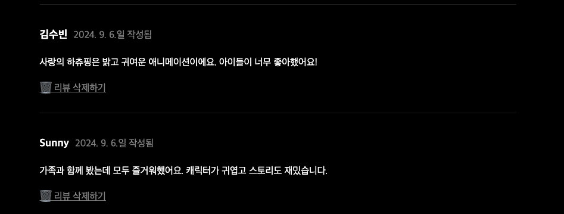
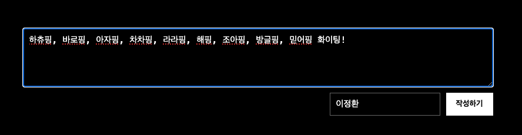

## 미션) 한입-씨네마 리뷰 조회 & 추가 기능 만들기

"한입 씨네마" 프로젝트에 **리뷰 조회 및 추가 기능**을 만들어주세요!

## 미션 제출 방법

미션 제출은 다음 방법중 하나를 선택하시면 됩니다.

1. 캡쳐를 통해 소스코드 or 실행 화면 공유
2. GitHub에 프로젝트 업로드 후 링크로 공유
3. 배포 후 결과물 공유

> [정답 보기](https://github.com/winterlood/onebite-next-challenge/blob/main/missions/day16/mission/answer)

## 미션 소개) 한입-씨네마 리뷰 조회 & 추가 기능 만들기

다음과 같이 "한입 씨네마" 프로젝트에 **리뷰 조회 및 추가 기능**을 만들어주세요!



### 0. 리뷰 타입 추가정의

이제부턴 영화 아이템 외에 리뷰 아이템도 함께 다루게 됩니다. 따라서 아래 정의한 리뷰 아이템 타입을 각자의 프로젝트의 src/types.ts(혹은 별도의 파일)에 정의해주세요

```typescript
export interface ReviewData {
  id: number;
  content: string;
  author: string;
  createdAt: string;
  movieId: number;
}
```

### 1. 리뷰 조회 기능 구현하기

다음 그림과 같이 현재 영화의 리뷰를 불러와 렌더링하는 기능을 구현해주세요  
참고로 특정 영화의 리뷰 데이터는 `~/review/movie/[id]` API를 통해 불러올 수 있어요  
자세한 사항은 API 문서를 확인해보세요

> 보너스 : 컴포넌트 단위로 페이지를 잘 분리해 구현해주세요!



### 2. 리뷰 추가 기능 구현하기

다음 그림과 같이 현재 영화에 리뷰를 추가하는 기능을 구현해주세요  
사용자가 입력한 리뷰를 **서버액션**을 활용해 데이터베이스에 추가해주세요  
실시간 화면 갱신은 필요하지 않습니다. 새로고침시 새로운 리뷰가 반영되도록 만들어주세요


