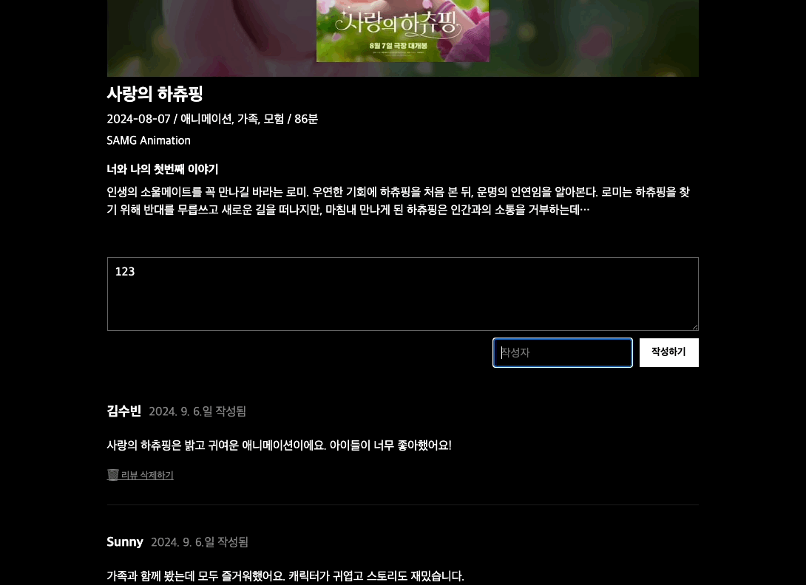

## 미션) 한입-씨네마 리뷰 기능 완성하기

"한입 씨네마" 프로젝트의 리뷰 기능을 완성해주세요

## 미션 제출 방법

미션 제출은 다음 방법중 하나를 선택하시면 됩니다.

1. 캡쳐를 통해 소스코드 or 실행 화면 공유
2. GitHub에 프로젝트 업로드 후 링크로 공유
3. 배포 후 결과물 공유

> [정답 보기](https://github.com/winterlood/onebite-next-challenge/blob/main/missions/day17/mission/answer)

## 미션 소개) 한입-씨네마 리뷰 기능 완성하기

"한입 씨네마" 프로젝트의 리뷰 기능을 완성해주세요

### 1. 리뷰 추가 기능 업그레이드하기

`useActionState`와 `revalidatePath` 또는 `revalidateTag`을 활용해  
이전 미션에서 만든 리뷰 추가 기능을 업그레이드 해 주세요! 구체적은 요구사항은 다음과 같습니다.

- 로딩 상태를 관리할 수 있어야 합니다. (로딩 UI가 렌더링 되어야 함)
- 로딩중 중복 제출을 방지할 수 있어야 합니다.
- 새로고침 하지 않아도 등록된 리뷰를 볼 수 있어야 합니다.

### 2. 리뷰 삭제 기능 구현하기

리뷰 삭제 기능을 구현해주세요. 구체적인 요구사항은 다음과 같습니다.

- 로딩 상태를 관리할 수 있어야 합니다. (로딩 UI가 렌더링 되어야 함)
- 로딩중 중복 제출을 방지할 수 있어야 합니다.
- 새로고침 하지 않아도 리뷰가 삭제되어야 합니다.
