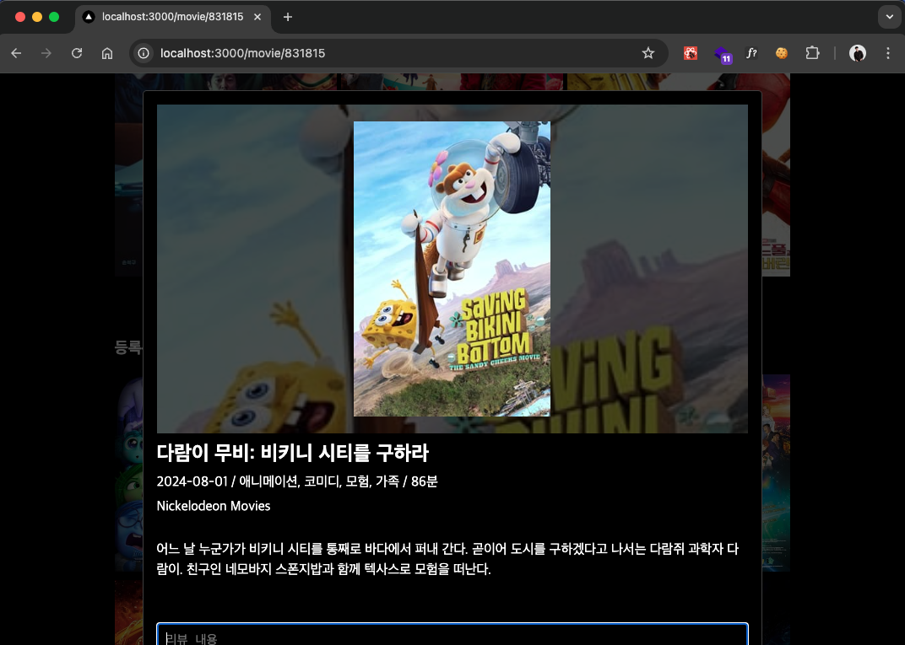
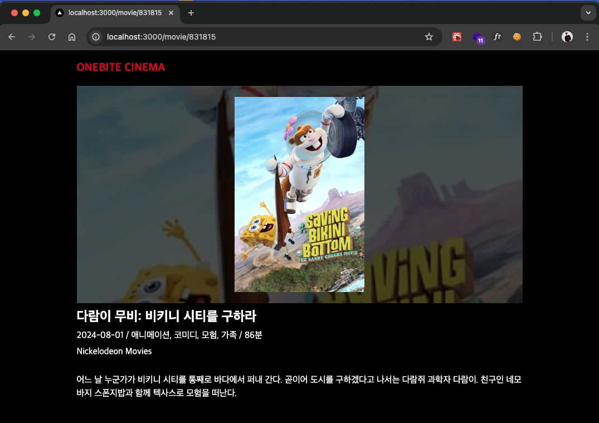

## 미션) 한입-씨네마 영화 페이지 인터셉팅 모달 구현하기

"한입 씨네마" 영화 페이지의 인터셉팅 모달을 구현해주세요!

## 미션 제출 방법

미션 제출은 다음 방법중 하나를 선택하시면 됩니다.

1. GitHub에 프로젝트 업로드 후 링크로 공유
2. 캡쳐를 통해 소스코드 or 실행 화면 공유
3. 배포 후 결과물 공유

> [정답 보기](https://github.com/winterlood/onebite-next-challenge/blob/main/missions/day18/mission/answer)

## 미션 소개) 한입-씨네마 영화 페이지 인터셉팅 모달 구현하기

다음 요구사항을 만족하도록 영화 상세 페이지(movie/[id])의 인터셉팅 모달을 구현해주세요

- 영화 페이지에 CSR 방식으로 접근하면 페이지가 다음 그림처럼 모달 창으로 열려야 합니다.

  

- 주소 직접 입력, 새로고침 등으로 영화 페이지에 초기접속 할 경우에는 모달창으로 열리지 않습니다.

  

> Tip. 패럴랠 라우트와 인터셉팅 라우트는 불안정한 기능으로 개발 도중 잦은 오류를 만나게 될 수 있습니다. 이를 방지하려면 폴더나 파일명을 변경할 때 마다 넥스트 서버를 가동 중단한 다음 .next 폴더를 삭제하고 다시 서버를 가동하는걸 추천합니다.
